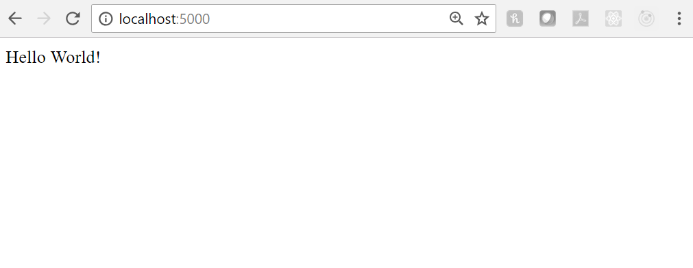
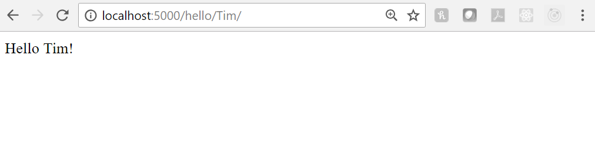
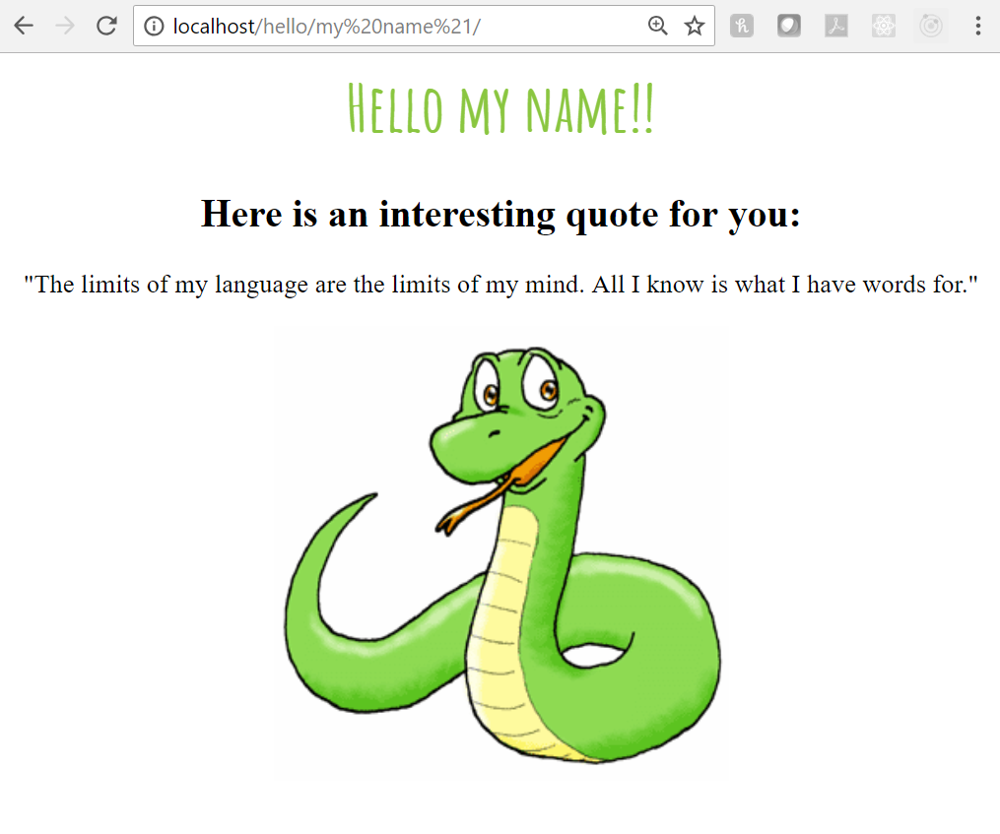
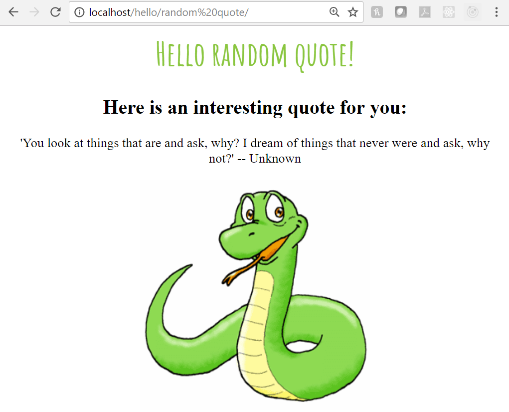

# CS52 Workshop:  Building a Flask Web App


Flask is a Python web framework that was originally developed by a group of Python enthusiasts as an April Fool's joke :stuck_out_tongue_closed_eyes:! It's now grown to become one of the most popular Python web frameworks.

People love Flask for the same reasons that they love Python: it's simple, quick, and user-friendly to set up and learn. For these reasons, it's popular amongst beginners, people who are looking to quickly get an app up and running, and hackathon participants. However, its downsides are that it has limited features, it's not particularly async-friendly, and it's more difficult to create more complex applications.

## Overview

We're going to build a very simple web app with Python and HTML/CSS using a micro-framework called Flask. Here's an overview of what you're going to accomplish by the end of this workshop:

* [ ] Create a Flask web app using 7 lines of code!
* [ ] Add routes
* [ ] Use templates
* [ ] Make a web page with inspirational quotes

## Setup

Install Flask using the command below:

```
$ pip install Flask
```

That was easy, wasn't it? And it doesn't get harder than that!! Flask is great.

## Step by Step

### Step 1 - Hello World

Fork this repo!

Create a file called **hello.py** and copy the following code into the file:

```
from flask import Flask
app = Flask(__name__)

@app.route("/")
def hello():
    return "Hello World!"

if __name__ == "__main__":
    app.run()
```

**Remember: Flask uses Python, so spacing/tabs/indents matter!** Run your web app to make sure that everything's working:

```
$ python hello.py
```

Open http://localhost:5000/ in your web browser. It should look something like this:



Congratulations, you've created a web app using Flask in just 7 lines of code!

### Step 2 - Creating URL Routes

Routes are very simple to set up using Flask. We're going to be creating the following routes:

```
/hello
/hello/name/
```
Create a file called **app.py** and copy the following code into the file:

```
from flask import Flask
app = Flask(__name__)

@app.route("/")
def index():
    return "Flask App!"

@app.route("/hello")
def hello():
    return "Hello World!"

@app.route("/hello/<string:name>/")
def getMember(name):
    return "Hello " + name + "!"

if __name__ == "__main__":
    app.run()
```

Restart the application by running the following command on your terminal:

```
$ python app.py
```
If this doesn't work for you, try `sudo python app.py`. Try out these URLS in your browser:

* http://localhost:5000/
* http://localhost:5000/hello
* http://localhost:5000/hello/Tim

Your web browser should look something like this for the */hello/Tim* route:



### Step 3 - Styling

We're going to separate out our Python code and HTML/CSS using templates. Make a directory called **templates**. Inside this folder, create a template called **test.html** and copy the following code into the file:

```



<div class="block1">
<h1>Hello {{name}}!</h1>
  <h2>Here is an interesting quote for you: </h2>
  <p>
"The limits of my language are the limits of my mind. All I know is what I have words for."
  </p>

</div>

```

Then, in the same folder, create a file called **layout.html** and copy the following code into the file:

```
<html>
<head>
    <title>Website</title>
<style>
@import url(http://fonts.googleapis.com/css?family=Amatic+SC:700);

body{
    text-align: center;    
}
h1{
    font-family: 'Amatic SC', cursive;
    font-weight: normal;
    color: #8ac640;
    font-size: 2.5em;
}

</style>

</head>
<body>
 

</body>
</html>
```

It's technically best practice to NOT have your HTML and CSS in the same file, but we'll just keep it like this for the sake of having one less file :sunglasses:.

Finally, adjust your **app.py** file so that the code looks like this:

```
from flask import Flask, flash, redirect, render_template, request, session, abort

app = Flask(__name__)

@app.route("/")
def index():
    return "Flask App!"

@app.route("/hello")
def hello_world():
    return "Hello World!"

@app.route("/hello/<string:name>/")
def hello(name):
    return render_template(
        'test.html',name=name)

if __name__ == "__main__":
    app.run(host='0.0.0.0', port=80)
```

Now run `python app.py` again and go to the URL http://localhost/hello/YOUR_NAME. If this doesn't work for you, try `sudo python app.py`. It should look something like this:



### Step 4 - More Interesting Things

We're going to spice things up a little bit by varying the quotes displayed on the webpage! We'll need to adjust our render function so that we can choose a quote at random and then pass in multiple variables (name and quote) to be displayed.

So, in your **app.py** file,

1. Import randint by adding this to the top of your file:

```
from random import randint
```

2. Change the `hello(name)` function to read:

```
def hello(name):
    quotes = [ "'If people do not believe that mathematics is simple, it is only because they do not realize how complicated life is.' -- John Louis von Neumann ",
               "'Computer science is no more about computers than astronomy is about telescopes' --  Edsger Dijkstra ",
               "'To understand recursion you must first understand recursion..' -- Unknown",
               "'You look at things that are and ask, why? I dream of things that never were and ask, why not?' -- Unknown",
               "'Mathematics is the key and door to the sciences.' -- Galileo Galilei",
               "'Not everyone will understand your journey. That's fine. It's not their journey to make sense of. It's yours.' -- Unknown"  ]
    randomNumber = randint(0,len(quotes)-1)
    quote = quotes[randomNumber]

    return render_template(
        'test.html',**locals())
```

We pass multiple variable usings `**locals()`. `**` allows us to keyword argument unpack the built-in Python function `locals()`, which returns the local dictionary.

Now, slightly modify your **test.html** file so that it looks like this:

```



<div class="block1">
<h1>Hello {{name}}!</h1>
  <h2>Here is an interesting quote for you: </h2>
  <p>
{{quote}}
  </p>

</div>

```

Finally, run `python app.py` once last time. If this doesn't work for you, try `sudo python app.py`. Each time you view http://localhost/hello/YOUR_NAME, you should see a different quote!



Annnnnd, you're done!!!

## What to Submit / Extra Credit

Submit the link to your forked repo containing the code for this workshop!

Here are a couple of potential extra credit ideas:

* Create a couple of new routes that display new/different content
* Add a button to some page that redirects you to another page

## Summary / What you Learned

* [x] Create a Flask web app using 7 lines of code!
* [x] Add routes
* [x] Use templates
* [x] Make a web page with inspirational quotes

## Resources

* [Tutorial that this workshop is based off of](https://pythonspot.com/flask-web-app-with-python/)
* [In-depth tutorial to make a CRUD app using Flask](http://flask.pocoo.org/docs/1.0/tutorial/)
* [Flask Mega-Tutorial](https://blog.miguelgrinberg.com/post/the-flask-mega-tutorial-part-i-hello-world)
* [Flask main page](http://flask.pocoo.org/)
